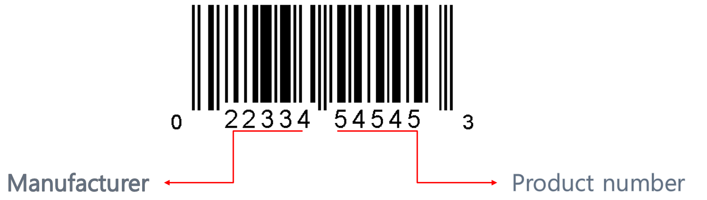

```Project Period : 2018.07.13 ~ 2018.08.11```

### Aim of classification
- Segment 38 TripType of visiting custmoers in Walmart to improve customer's shopping experience.


### Data Description
- train.csv : 647054 rows, 7 columns(TripType, VisitNumber, Weekday, Upc, ScanCount DepartmentDescription, FinelineNumber)
- test.csv : 653646 rows, 6 columns(VisitNumber, Weekday, Upc, ScanCount DepartmentDescription, FinelineNumber)
- sample_submission.csv


### File description

- ___Preprocessing - make X_train, y_train, X_test.ipynb : Data preprocessing___

  **1. Fill in missing values and refining data**
  
    **- DepartmentDescription**
    
      - Number of missing value - 1361.
      - One of attribute of DepartmentDescription, "MENSWEAR" change to "MENS WEAR".
      - One of attribute of DepartmentDescription, "HEALTH AND BEAUTY AIDS"(only have train data) change to "BEUTY".
      
    **- FinelineNumber**
    
      - Number of missing value - 4129.
      
    **- Upc**
    
      - Number of missing value - 4129.
      - Range of the length of Upc is 3 to 12, so Restore the length of the Upc to 12.
      - Divide the Upc into manufacturer number and product number.
    
    
    
    
  **2. Data encode and derivation**
  
    **- Encode**
    
      - DepartmentDescription
      - Weekday
      - FinelineNumber
      - UPC(Manufacturer part)
      
    **- Derivation**
    
      - Divide by abs_scancount for each above columns were encoded.
      - Add "refund rate" column.
      
  **3. Feature Selection**
  
      - DepartmentDescription : 67 columns
      - Weekday : 7 columns
      - FinelineNmber : 5045 columns ( exist in train and test data at the same time )
      - UPC(Manufacturer part) : 5304 columns ( exist in train and test data at the same time )
      - ScanCount : 1 column
      - Refund rate : 1 column
      
      total of columns : 10425 columns
      total of row : 95674 columns ( Group by 'VisitNumber" )
      train data shape : (95674, 10425)

- ___preprocessing_functions.py : functions for UPC preprocessing___


### Model

- ___Use a tree-based model.___

      - RandomForest
      - Xgboost

### Summary & Result

- ___Summary___

    - We classified customer types with information about product categories and customer purchase/refund records.
    
    - Assumptions through Domain Knowledge and Universal Knowledge for Classification
  
        - Use experience knowledge as a buyer
            - The best-selling items in the same category are likely to be sold.
            - The same customer will most likely buy the same things they used to buy.
        
        - Use all information within a category data(DepartmentDescription, FinelineNumber, UPC, Weekday)
            - Different customer types will have different product categories that customers purchase.
            - The more product categories are disaggregated, they can predict more precisely customer types.
            
        - Use tree-based model for interaction of features
      
      
- ___Result___

   - Last model selected : Xgboost
   - Parameter : 
   
   ***Score***
   
   - top 20%
   
   
   
### Feedback

- Using too many features

      - The number of features is 10425.
      - Too many features cause overfitting.
      
- Did not consider walmart's own rules for dividing TripType

      - Did not consider walmart's own rules for dividing customer types.
      - Only focus the rules that the data shows us.

----------------------------------------------------------------------------------------------------------------------------
      
```프로젝트 기간 : 2018.07.13 ~ 2018.08.11```

### 분류의 목적
- 월마트에 방문한 고객의 쇼핑정보를 가지고 고객유형을 38종류로 분류한다.


### 데이터 설명
- train.csv : 647054 행, 7 열(TripType, VisitNumber, Weekday, Upc, ScanCount DepartmentDescription, FinelineNumber)
- test.csv : 653646 행, 6 열(VisitNumber, Weekday, Upc, ScanCount DepartmentDescription, FinelineNumber)
- sample_submission.csv      
      

### 파일 설명

- ___Preprocessing - make X_train, y_train, X_test.ipynb : 데이터 전처리___

  **1. 누락된 값 채우고 데이터 정제하기**
  
    **- DepartmentDescription**
    
      - 누락된 값 갯수 - 1361.
      - DepartmentDescription의 값 중에서 같은 의미지만 컴퓨터에서 다르게 인식되는, "MENSWEAR"를 "MENS WEAR"로 바꾸어 통일해 준다.
      - DepartmentDescription의 값 중에서 오직 Train 데이터에만 있는 "HEALTH AND BEAUTY AIDS"를 "BEUTY"로 바꾸어 분류를 용이하게 해준다.
      
    **- FinelineNumber**
    
      - 누락된 값 갯수 - 4129.
      
    **- Upc**
    
      - 누락된 값 갯수 - 4129.
      - 3~12자리로 다양한 Upc 값을 12자리로 복원하여 저장
      - Upc를 제조사 번호와 상품 넘버로 나누어 준다.

    
    
    
  **2. 데이터 인코드와 파생**
  
    **- 인코드**
    
      - DepartmentDescription
      - Weekday
      - FinelineNumber
      - UPC(Manufacturer part)
      
    **- 파생**
    
      - 스캔카운트의 절대값 합으로 각각의 특성들을 나누어 인코드 해준다.(각 상품별 구매한 비율을 나타내기 위함)
      - 환불 비율을 의미하는 refund_rate 
      
  **3. 특성 선택**
  
      - DepartmentDescription : 67 열
      - Weekday : 7 열
      - FinelineNmber : 5045 열 ( train과 test 데이터에 모두 존재하는 값 )
      - UPC(Manufacturer part) : 5304 열 ( train과 test 데이터에 모두 존재하는 값 )
      - ScanCount : 1 열
      - Refund rate : 1 열
      
      총 열 갯수 : 10425 열
      총 행 갯수 : 95674 행 ( Group by 'VisitNumber" )
      train data shape : (95674, 10425)

- ___preprocessing_functions.py : Upc 전처리를 위한 함수 모음___

### 모델

- ___트리 기반 모델 사용.___

      - RandomForest
      - Xgboost

### 요약 및 결과

- ___요약___

    - 월마트 내 상품 카테고리 정보와 고객의 구매 환불 정보를 통해 고객 유형을 분류해 보았다.
    
    - 분류를 위한 도메인 지식과 보편적 지식을 통한 가정들
  
        - 구매자로서의 경험
            - 같은 카테고리 내에 아이템중 가장 많이 팔리는 물품이 가장 잘 팔리는 물건이다.
            - 같은 고객은 평소 자주 사던 물품을 계속해서 구매할 것이다.
        
        - 모든 카테고리 데이터 사용(DepartmentDescription, FinelineNumber, UPC, Weekday)
            - 고객 유형에 따라 고객이 구매하는 제품의 카테고리가 달라질 것이다.
            - 더 많은 제품 카테고리가 세분화될수록 더 정확한 고객 유형을 예측할 수 있을 것이다.
            
        - 특성들 간의 다양한 관계 고려를 위해 트리기반 모델 사용
      
      
- ___결과___

   - 최종 선택 모델 : Xgboost
   - 패러미터 : 
   
   ***점수***
   
   - 상위 20%
   
   
   
### 피드백

- 너무 많은 특성을 사용하였다.

      - 총 사용한 특성 갯수는 10425개.
      - 너무 많은 특성을 사용할 경우 train data에 오버피팅 될 가능성이 커진다.
      
- 기존에 월마트 내에서 고객유형을 나눌 때 사용한 규칙을 역추적 해보지 못하였다.

      - 월마트가 자체적을 고객 유형을 나누는 규칙을 생각해 보았다면 더 좋은 결과를 냈을 가능성이 있다.
      - 오직 주어진 데이터에만 초점을 맞추었다는 아쉬움이 남는다.
