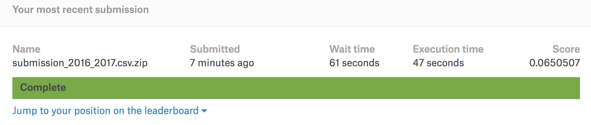

```Project Period : 2018.06.14 ~ 2018.07.08```

```선형회귀로 풀어보는 질로우 집 가치 예측 (Zillow's Home Value Prediction using LinearRegression)```

### Aim of Regression
- Predict Zestimate value(Zillow's own model for predict house value)


### Data Description
- train_2016_v2.csv : 90275 rows, 3 columns(parcelid,	logerror,	transactiondate)
- train_2017.csv : 77613 rows, 3 columns(parcelid,	logerror,	transactiondate)
- properties_2016.csv : 2985217 rows, 58 columns
- properties_2017.csv : 2985217 rows, 58 columns
- sample_submission.csv


### File Description
- columns_dictionary_2016.ipynb : classify type of value for each 58 columns (category / scalar)
    ```columns_dictionary_2016.ipynb : 특성(열)의 데이터 종류를 카테고리와 수치를 나타내는 숫자 값으로 분류한 2016년 사전```

- columns_dictionary_2017.ipynb : classify type of value for each 58 columns (category / scalar)
    ```columns_dictionary_2017.ipynb : 특성(열)의 데이터 종류를 카테고리와 수치를 나타내는 숫자 값으로 분류한 2017년 사전```

- LinearRegression_model_2016.ipynb : LinearRegression model for 2016
    ```LinearRegression_model_2016.ipynb : scikit-learn의 선형회귀 모델을 사용하여 만든 2016년 zillow 모델 (propeties2016년 사용)```
    
- LinearRegression_model_2017.ipynb : LinearRegression model for 2017
    ```LinearRegression_model_2017.ipynb : scikit-learn의 선형회귀 모델을 사용하여 만든 2017년 zillow 모델 (properties2017 사용)```
    
    
### Preprocessing

1. fill in mssing value

- Category data
    - fill in missing value with most frequent value
- Scalar data
    - fill in missing value using MICEdata imputation

2. Featrue Selection

- Select only those that are linearly correlated with our target 'logerror'


### Model

- LinearRegression of sklearn


### Result

- 2666 / 3779 : top 70%



### Feedback

- Initially there was a constraint that the project only use linear model
- If I try a nonlinear model, I'll get better results.
